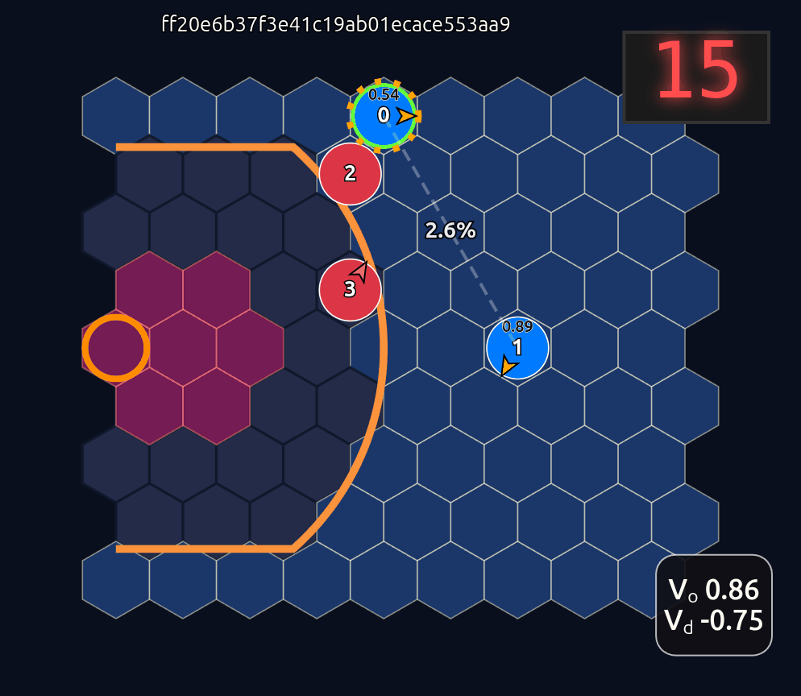
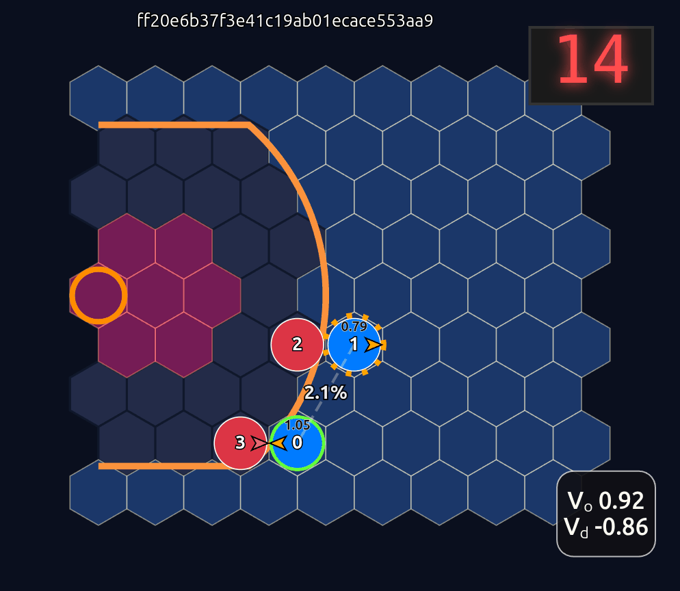
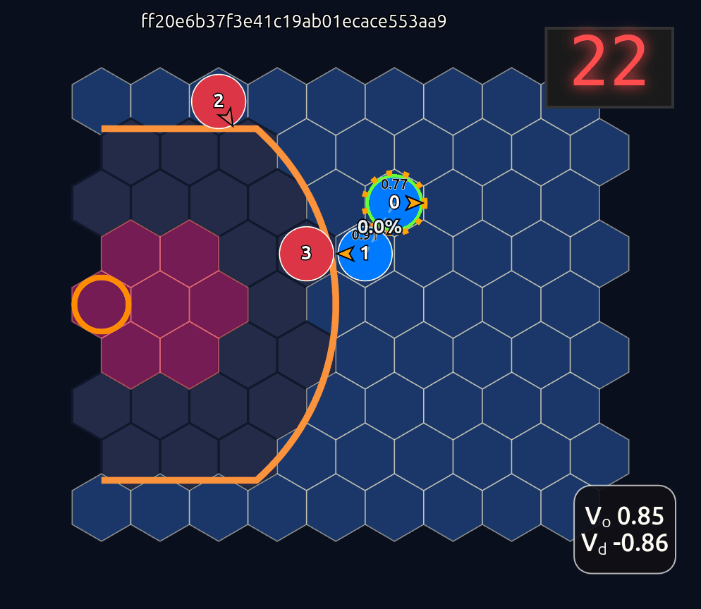
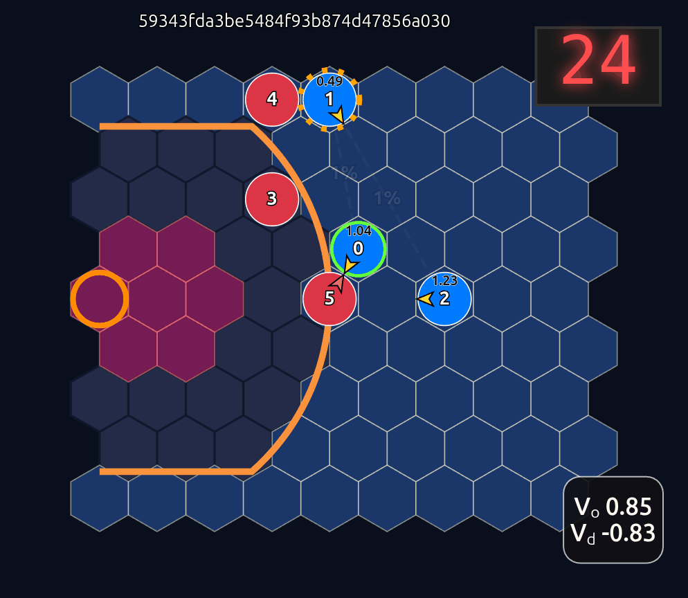
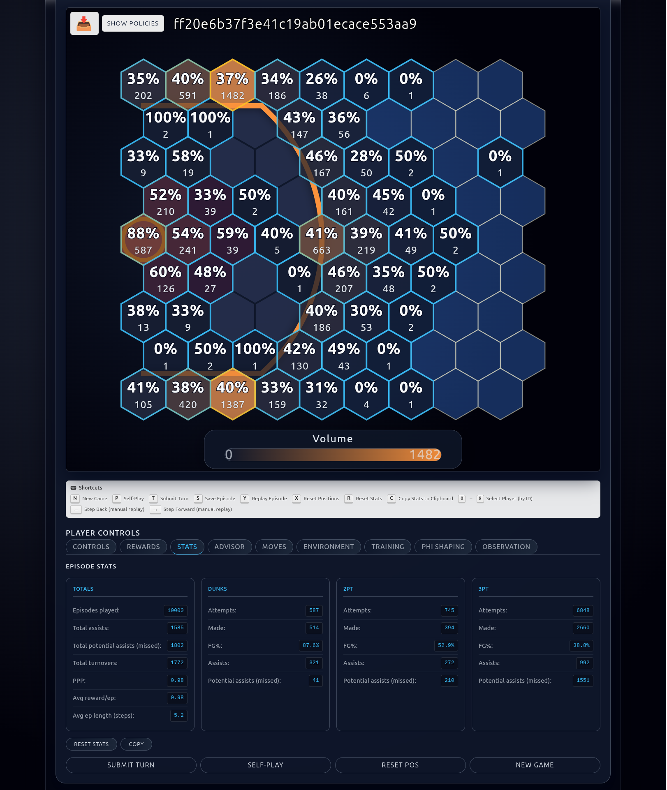

# BasketWorld

BasketWorld is a hex-grid, Gymnasium-compatible half-court basketball simulator for self-play reinforcement learning. A unified PPO policy (offense/defense encoded with role flags) trains against itself, logs to MLflow, and can be driven through a FastAPI backend plus a Vue front-end for interactive play, analysis, and evaluation. In the web app you can play games against the AI models or have them play against each other ("self-play"). Here are some sample self-play episodes.






You can even run thousands of episodes of self-play and look at a detailed statistical summary of game play and shot charts.



## What's new
- **Absolute-coordinate observations**: Egocentric rotation is gone; models need retraining. Ball handler position, hoop location, EP/risk features, and action masks are all absolute-court based.
- **Unified policy pipeline**: Training saves `unified_*.zip` checkpoints with optional dual-critic/dual-policy heads and pass-logit bias. Role flags encode offense/defense so one network drives both teams.
- **Interactive stack refresh**: Backend loads policies directly from MLflow by `run_id`, supports policy swapping, evaluation batches, MCTS advice, phi shaping, skill overrides, replays, and shot/pass diagnostics surfaced in the Vue UI.
- **MLflow-first configuration**: Environment/training params and role-flag encoding are read from MLflow for faithful evaluation; optional `.env.aws` enables S3 artifacts without touching global AWS config.

## Repo map
```
basketworld/
- basketworld/           # Core env: envs/, sim/, utils/, custom SB3 policies
- train/                 # Self-play PPO training loop, callbacks, schedules
- app/
  - backend/             # FastAPI service that loads MLflow runs and runs games
  - frontend/            # Vue 3 + Vite UI (board, controls, analytics, replays)
- analytics/             # Evaluation/visualization scripts (heatmaps, ELO, etc.)
- readmes/               # Design docs and migration notes (obs, EP, phi, etc.)
- docs/                  # Research notes (opponent sampling, continuation, ...)
- requirements.txt       # Python deps (installs package in editable mode)
- start_mlflow*.sh       # Convenience scripts for local MLflow (optional)
```

## Setup
### Python (env, training, backend)
```bash
python -m venv .venv && source .venv/bin/activate
pip install -r requirements.txt       # installs basketworld in editable mode
# Backend deps are included; alternatively: pip install -r app/backend/requirements.txt
```

Run MLflow locally (default for training/backend):
```bash
mlflow ui --backend-store-uri sqlite:///mlflow.db --port 5000
```

S3 artifacts (project-scoped credentials, auto-loaded):
```
# .env.aws at repo root (already gitignored)
MLFLOW_ARTIFACT_ROOT=s3://your-bucket/mlflow-artifacts
MLFLOW_AWS_ACCESS_KEY_ID=...
MLFLOW_AWS_SECRET_ACCESS_KEY=...
MLFLOW_AWS_DEFAULT_REGION=us-east-1
```

### Frontend
```bash
cd app/frontend
npm install
echo "VITE_API_BASE_URL=http://localhost:8080" > .env
npm run dev   # opens http://localhost:5173
```

## Train unified PPO agents
The training loop alternates self-play on a unified policy, logs everything to MLflow, and saves checkpoints under `models/unified_iter_<alt>.zip` (plus `unified_policy_final.zip`).

Example (3v3, dual critics/policies, scheduled alternations):
```bash
python train/train.py \
  --grid-size 16 --players 3 --shot-clock 24 \
  --alternations 30 \
  --steps-per-alternation 20000 \
  --steps-per-alternation-end 40000 \
  --steps-per-alternation-schedule log \
  --num-envs 8 \
  --use-dual-policy --use-dual-critic \
  --ent-coef-start 0.02 --ent-coef-end 0.001 --ent-schedule linear \
  --mlflow-experiment-name BasketWorld_Training
```
Key capabilities:
- **Role-flag unified policy** with optional dual critics/policies (`--use-dual-critic`, `--use-dual-policy`) and pass-logit bias scheduling.
- **Alternation scheduling** (`--steps-per-alternation*`, `--continue-run-id`/`--continue-schedule-mode`) and periodic evals (`--eval-freq`, `--eval-episodes`).
- **Environment controls** (spawn distances, pressure/defense knobs, shot clock, dunk/three rules, phi shaping hooks) logged to MLflow so backend/UI recreate runs faithfully.

Grab the MLflow `run_id` for the interactive app; old egocentric models are incompatible with the absolute-coordinate obs.

## Interactive app
### Backend (FastAPI)
```bash
uvicorn app.backend.main:app --host 0.0.0.0 --port 8080 --reload
```
- Reads env/training params, role-flag encoding, and available unified policies directly from MLflow for a given `run_id`.
- Caches and loads `unified_*.zip` artifacts; optional frozen opponent policy selection.
- Endpoints cover stepping games, policy probabilities, MCTS advice, batch evaluation, phi-shaping tweaks, offense skill overrides, shot/pass diagnostics, replays, GIF/PNG exports, and policy swapping mid-session.

### Frontend (Vue 3 + Vite)
- Enter an MLflow `run_id`, choose offense/defense side, and pick a unified policy for you vs. the (optional) frozen opponent.
- Play manually or toggle AI suggestions/self-play; action masks and policy logits are surfaced.
- Tabs for environment tweaks (skills, shot clock), phi shaping, evaluation batches, replays/manual stepping, shot/pass overlays, and reward breakdowns.
- Saves episodes locally from backend endpoints; supports cached policy lists per run.

## Core concepts
- **Hex court + simultaneous actions**: MultiDiscrete action space (move/shoot/pass for each player) with illegal-action resolution strategies.
- **Absolute observations**: Player coords, hoop vector, ball handler flag, EP/turnover/steal risk features; role flag distinguishes offense/defense for unified policies.
- **Reward shaping**: Phi shaping hooks, expected-points diagnostics, defender pressure, three-second/illegal-defense enforcement, optional dunk/3pt rules.
- **MLflow-first**: Training, evaluation, backend, and UI all hydrate from MLflow params/artifacts; `.env.aws` keeps project-specific S3 credentials isolated.

## Quick references
- Train: `python train/train.py ...` (see `train/train.py` for full CLI)
- Backend: `uvicorn app.backend.main:app --port 8080`
- Frontend: `npm run dev` in `app/frontend` with `VITE_API_BASE_URL` set
- Docs: `readmes/` (obs migration, EP refactors, phi shaping, coordinate systems) and `docs/` (opponent sampling, schedule continuation)
