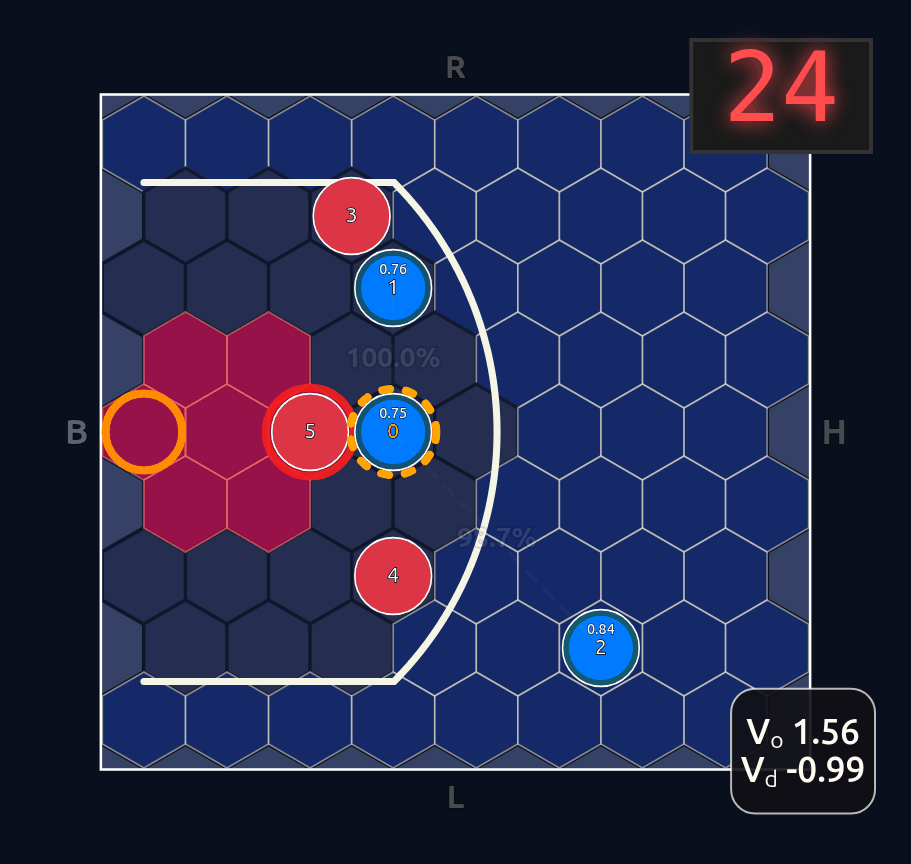
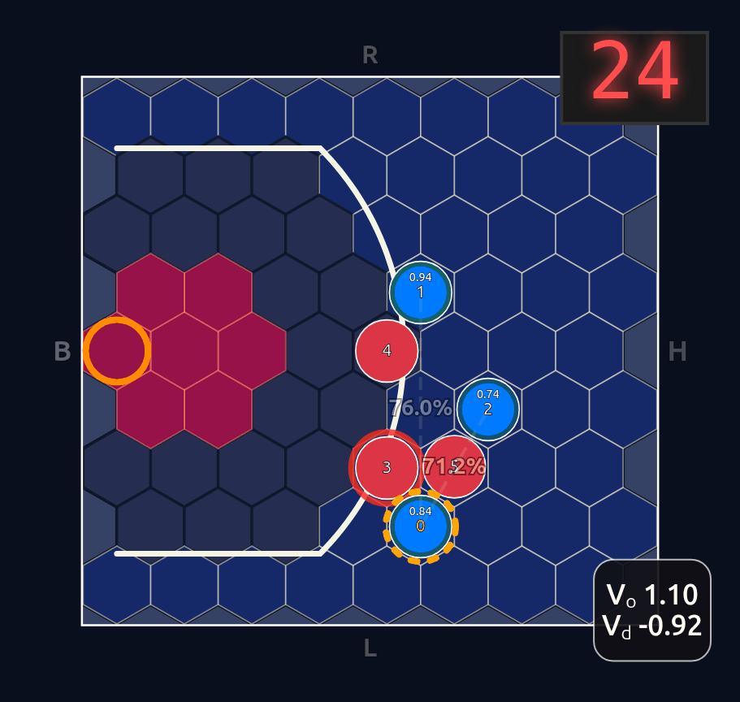
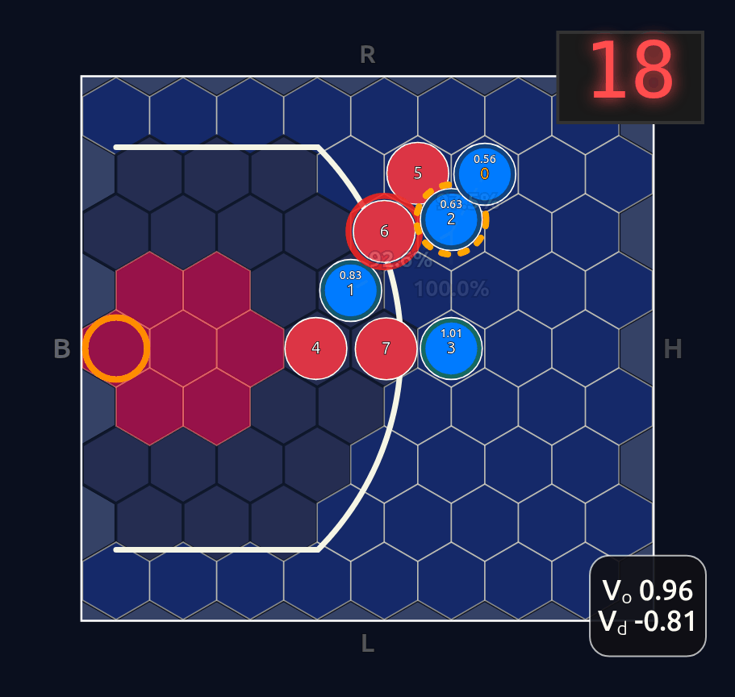
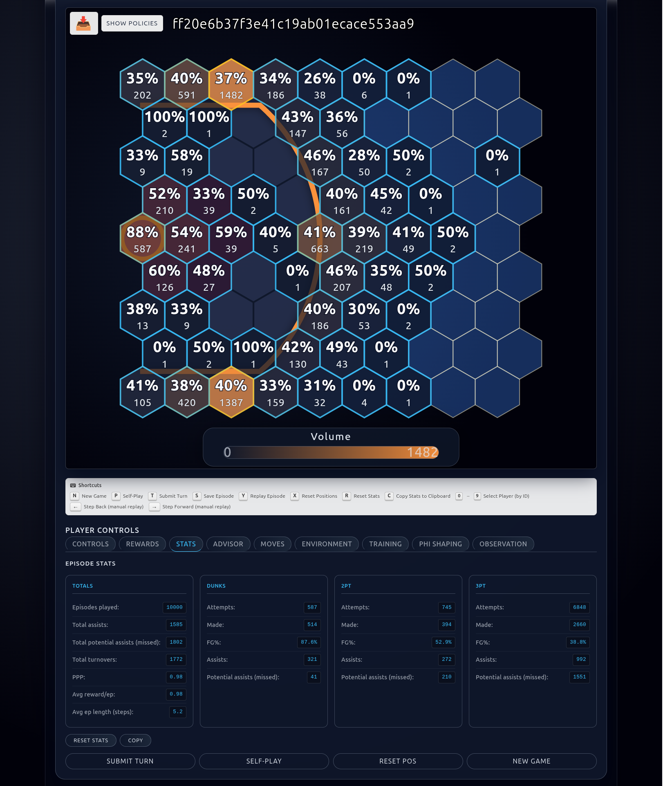

# BasketWorld

BasketWorld is a hex-grid, Gymnasium-compatible half-court basketball simulator for self-play reinforcement learning. A unified PPO policy (offense/defense encoded with role flags) trains against itself, logs to MLflow, and can be driven through a FastAPI backend plus a Vue front-end for interactive play, analysis, and evaluation. In the web app you can play games against the AI models or have them play against each other ("self-play"). Here are some sample self-play episodes.





You can even run thousands of episodes of self-play and look at a detailed statistical summary of game play and shot charts.



## What's new
- **JAX is now the primary training path for new work**: `basketworld_jax/` contains the batched JAX environment, Flax actor-critic, custom PPO loop, Optax optimization, Orbax checkpointing, MLflow logging, JAX-native evaluation, and JAX-native dev/playable runtime. The SB3/Python stack remains in `basketworld/` and `train/` for legacy models, parity checks, and reference behavior.
- **JAX-native environment parity**: The JAX env now covers the major gameplay features needed for current experiments: 3-on-3 half-court self-play, absolute/set-token observations, pointer-targeted passing, lane and illegal-defense rules, shot-clock turnovers, start templates with jitter/mirroring, sampled player skills, phi shaping, and deterministic-opponent episode sampling.
- **Set-token attention model**: Current JAX checkpoints use tokenized player observations, attention over player/global tokens, offense/defense policy and value heads, role conditioning, action masks, pointer-targeted pass logits, state values, and attention payloads for UI inspection.
- **Intent/play system**: The JAX path includes offensive latent intents with play codenames, intent-conditioned policy embeddings, a set-step discriminator, selector head, optional multiselect, warmup/ramp schedules, intent reward diagnostics, t-SNE sample dumps, playbook analysis, and counterfactual UI tooling.
- **Historical self-play and opponent sampling**: JAX training supports grouped frozen-opponent sampling from historical MLflow checkpoints, checkpoint pools, deterministic-vs-sampled opponent episodes, and separate rollout/update/end-to-end speed metrics.
- **JAX-native eval and playable app support**: The backend can load SB3 or JAX runs by MLflow `run_id`. For JAX checkpoints, evaluation, policy visualization, self-play, attention, playbook, counterfactuals, and playable mode run against the JAX-native runtime instead of replaying through the old Python environment.
- **MLflow-first artifacts and metadata**: Training writes compact checkpoints, metadata, config params, eval summaries, intent samples, and UI-facing run artifacts to MLflow. Local model folders are treated as cache/output directories, not the source of truth.

## Repo map
```
basketworld/
- basketworld/                 # Legacy Python/Gymnasium env, SB3 wrappers, policies, and utility code
- basketworld_jax/             # Current JAX stack for high-throughput training/eval/inference
  - env/                       # JAX environment kernel: reset, step, rewards, rules, templates, observations
  - models/                    # Flax actor-critic: attention policy, value heads, selector, pointer passing
  - train/                     # CLI, schedules, rollout/update orchestration, MLflow logging, opponent pools
  - rollout/                   # Rollout helpers and compiled rollout-facing utilities
  - intent/                    # Intent discriminator, intent bonuses, holdout metrics, sample dumping
  - eval/                      # Fast JAX-native evaluation path and stat aggregation
  - inference/                 # Checkpoint loading and backend-facing JAX policy wrapper
  - checkpoints/               # Orbax save/load plus checkpoint metadata serialization
  - optim/                     # Optimizer helpers used by the JAX training path
  - config/                    # JAX config defaults and shared config structures
- train/                       # Legacy SB3 training entrypoints and callbacks
- app/
  - backend/                   # FastAPI app, MLflow loading, SB3/JAX adapters, eval/playable/dev runtimes
  - frontend/                  # Vue 3 + Vite UI: board, policy, eval, stats, playbook, playable mode
- analytics/                   # Offline analysis scripts: JAX intent t-SNE, replay checks, eval diagnostics
- benchmarks/                  # JAX/SB3 throughput and kernel benchmark scripts
- configs/                     # Shared runtime configs, including start template libraries
- docs/                        # Current architecture notes, JAX migration plans, objective/stability docs
- readmes/                     # Older design notes and focused feature specs retained for reference
- tests/                       # Python tests outside backend-specific tests
- scripts/                     # Utility scripts for local workflows and maintenance
- requirements.txt             # Python deps for backend/training/dev usage
- start_mlflow*.sh             # Convenience scripts for local MLflow tracking/artifacts
```

## Setup
### Python (env, training, backend)
```bash
python -m venv .venv && source .venv/bin/activate
pip install -r requirements.txt       # installs basketworld in editable mode
# Backend deps are included; alternatively: pip install -r app/backend/requirements.txt
```

Run MLflow locally (default for training/backend):
```bash
./start_mlflow.sh --disable-s3
```

S3 artifacts (project-scoped credentials, auto-loaded):
```
# .env.aws at repo root (already gitignored)
MLFLOW_ARTIFACT_ROOT=s3://your-bucket/mlflow-artifacts
MLFLOW_AWS_ACCESS_KEY_ID=...
MLFLOW_AWS_SECRET_ACCESS_KEY=...
MLFLOW_AWS_DEFAULT_REGION=us-east-1
```

### Frontend
```bash
cd app/frontend
npm install
echo "VITE_API_BASE_URL=http://localhost:8080" > .env
npm run dev   # opens http://localhost:5173
```

## Train unified PPO agents
The training loop alternates self-play on a unified policy, logs everything to MLflow, and saves checkpoints under `models/unified_iter_<alt>.zip` (plus `unified_policy_final.zip`).

Example (3v3, dual critics/policies, scheduled alternations):
```bash
python train/train.py \
  --grid-size 16 --players 3 --shot-clock 24 \
  --alternations 30 \
  --steps-per-alternation 20000 \
  --steps-per-alternation-end 40000 \
  --steps-per-alternation-schedule log \
  --num-envs 8 \
  --use-dual-policy --use-dual-critic \
  --ent-coef-start 0.02 --ent-coef-end 0.001 --ent-schedule linear \
  --mlflow-experiment-name BasketWorld_Training
```
Key capabilities:
- **Role-flag unified policy** with optional dual critics/policies (`--use-dual-critic`, `--use-dual-policy`) and pass-logit bias scheduling.
- **Alternation scheduling** (`--steps-per-alternation*`, `--continue-run-id`/`--continue-schedule-mode`) and periodic evals (`--eval-freq`, `--eval-episodes`).
- **Environment controls** (spawn distances, pressure/defense knobs, shot clock, dunk/three rules, phi shaping hooks) logged to MLflow so backend/UI recreate runs faithfully.

Grab the MLflow `run_id` for the interactive app; old egocentric models are incompatible with the absolute-coordinate obs.

## Interactive app
### Backend (FastAPI)
```bash
uvicorn app.backend.main:app --host 0.0.0.0 --port 8080 --reload
```
- Reads env/training params, role-flag encoding, and available unified policies directly from MLflow for a given `run_id`.
- Caches and loads `unified_*.zip` artifacts; optional frozen opponent policy selection.
- Endpoints cover stepping games, policy probabilities, MCTS advice, batch evaluation, phi-shaping tweaks, offense skill overrides, shot/pass diagnostics, replays, GIF/PNG exports, and policy swapping mid-session.

### Frontend (Vue 3 + Vite)
- Enter an MLflow `run_id`, choose offense/defense side, and pick a unified policy for you vs. the (optional) frozen opponent.
- Play manually or toggle AI suggestions/self-play; action masks and policy logits are surfaced.
- Tabs for environment tweaks (skills, shot clock), phi shaping, evaluation batches, replays/manual stepping, shot/pass overlays, and reward breakdowns.
- Saves episodes locally from backend endpoints; supports cached policy lists per run.

## Core concepts
- **Hex court + simultaneous actions**: MultiDiscrete action space (move/shoot/pass for each player) with illegal-action resolution strategies.
- **Absolute observations**: Player coords, hoop vector, ball handler flag, EP/turnover/steal risk features; role flag distinguishes offense/defense for unified policies.
- **Reward shaping**: Phi shaping hooks, expected-points diagnostics, defender pressure, three-second/illegal-defense enforcement, optional dunk/3pt rules.
- **MLflow-first**: Training, evaluation, backend, and UI all hydrate from MLflow params/artifacts; `.env.aws` keeps project-specific S3 credentials isolated.

## Quick references
- Train: `python train/train.py ...` (see `train/train.py` for full CLI)
- Backend: `uvicorn app.backend.main:app --port 8080`
- Frontend: `npm run dev` in `app/frontend` with `VITE_API_BASE_URL` set
- Pointer passing doc: `readmes/POINTER_TARGETED_PASS_MODE.md`
- Set-attention policy/value diagram: `readmes/SET_ATTENTION_POLICY_VALUE_ARCHITECTURE.md`
- Docs: `readmes/` (obs migration, EP refactors, phi shaping, coordinate systems) and `docs/` (opponent sampling, schedule continuation)
