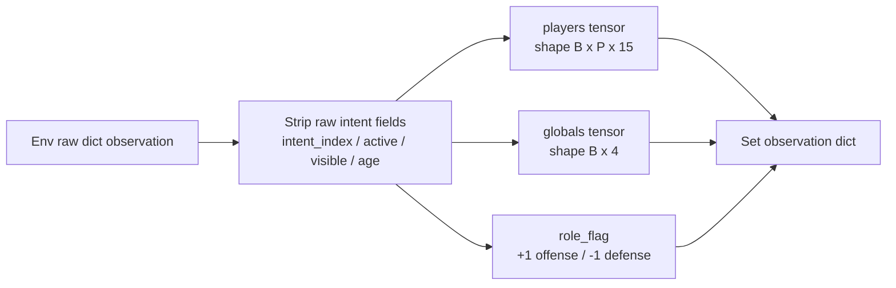
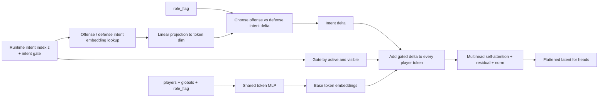
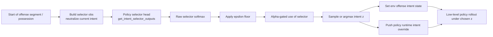
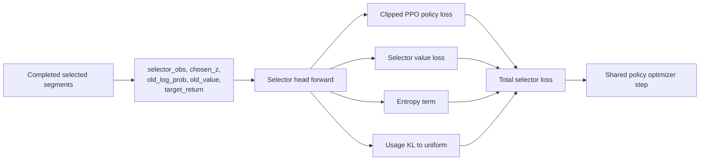
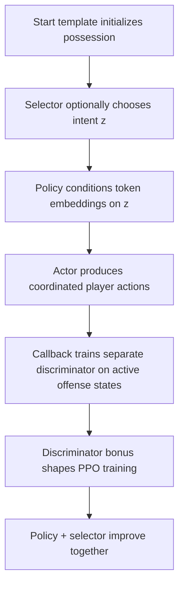

# Current Model Architecture

This document describes the current `set_obs + integrated selector + step discriminator` stack at a high level and then zooms into each major section.

The diagrams below match the implementation in:

- [train.py](/home/evanzamir/basketworld/train/train.py)
- [env_factory.py](/home/evanzamir/basketworld/train/env_factory.py)
- [wrappers.py](/home/evanzamir/basketworld/basketworld/utils/wrappers.py)
- [set_attention_policy.py](/home/evanzamir/basketworld/basketworld/policies/set_attention_policy.py)
- [dual_critic_policy.py](/home/evanzamir/basketworld/basketworld/policies/dual_critic_policy.py)
- [integrated_mu_selector_ppo.py](/home/evanzamir/basketworld/basketworld/algorithms/integrated_mu_selector_ppo.py)
- [callbacks.py](/home/evanzamir/basketworld/basketworld/utils/callbacks.py)
- [intent_discovery.py](/home/evanzamir/basketworld/basketworld/utils/intent_discovery.py)

## High-Level System

```mermaid
flowchart LR
    Env[BasketWorld Env<br/>start templates + self-play state] --> Wrap[SetObservationWrapper<br/>players + globals + role_flag]
    Wrap --> Policy[SetAttentionDualCriticPolicy]
    Policy --> Action[Per-player action logits<br/>or pointer-targeted pass distribution]
    Action --> Env

    subgraph Selector["Integrated Intent Selector"]
        SelObs[Neutralized offense-start obs] --> SelHead[Selector head<br/>mu(z|s)]
        SelHead --> SelChoice[Chosen intent z]
        SelChoice --> IntentState[Env offense intent state<br/>+ policy runtime override]
    end

    IntentState --> Policy
    Env --> SelObs

    subgraph Disc["Intent Diversity / DIAYN Callback"]
        Rollout[Completed rollout] --> StepExamples[Active offense steps / episodes]
        StepExamples --> DiscNet[IntentDiscriminator]
        DiscNet --> Bonus[Intent bonus]
        Bonus --> PPORewards[Rollout buffer rewards]
        PPORewards --> PPOTrain[PPO update]
    end

    Policy --> Rollout
    PPOTrain --> Policy
```

## Zoom-In: Observation Pipeline



Current token contents in [wrappers.py](/home/evanzamir/basketworld/basketworld/utils/wrappers.py):

- `q`, `r`
- team role token
- `has_ball`
- offense skill triplet
- lane-state feature
- expected points
- turnover / steal / distance-derived context

Current globals:

- `shot_clock`
- `pressure_exposure`
- hoop `q`
- hoop `r`

Important implementation detail:

- the set wrapper explicitly removes raw `intent_*` fields from the set observation in [wrappers.py#L37](/home/evanzamir/basketworld/basketworld/utils/wrappers.py#L37) and [wrappers.py#L59](/home/evanzamir/basketworld/basketworld/utils/wrappers.py#L59)
- intent reaches the low-level policy through runtime conditioning, not as a normal token feature

## Zoom-In: Low-Level Policy

```mermaid
flowchart LR
    Obs[Obs dict<br/>players / globals / role_flag] --> Extractor[SetAttentionExtractor]
    Extractor --> Tokens[Token sequence<br/>player tokens + CLS tokens]

    Tokens --> PiTokens[Player-token path]
    Tokens --> VfTokens[CLS-token path]
    Tokens --> SelCtx[Selector context token]

    PiTokens --> PiHead[Action head(s)]
    PiHead --> Dist[Action distribution]

    VfTokens --> VOff[Offense value head]
    VfTokens --> VDef[Defense value head]
    VOff --> VPick[Role-based value select]
    VDef --> VPick

    SelCtx --> SelHead[Selector logits head]
    SelCtx --> SelValue[Selector value head]
```

Current policy behavior in [set_attention_policy.py](/home/evanzamir/basketworld/basketworld/policies/set_attention_policy.py):

- action heads read player tokens only
- critics read the two CLS tokens
- optional selector head reads the first CLS token
- action space can be either directional logits or pointer-targeted pass factorization

## Zoom-In: Intent Conditioning Inside the Policy



This is implemented in:

- intent embeddings created in [set_attention_policy.py#L99](/home/evanzamir/basketworld/basketworld/policies/set_attention_policy.py#L99)
- runtime intent state applied in [set_attention_policy.py#L157](/home/evanzamir/basketworld/basketworld/policies/set_attention_policy.py#L157)
- role-aware override wiring done by [dual_critic_policy.py#L209](/home/evanzamir/basketworld/basketworld/policies/dual_critic_policy.py#L209)

Operationally, the low-level policy is doing:

```text
token_i = token_mlp(player_i, globals) + gate * W_role * e(intent_z)
```

before self-attention.

## Zoom-In: How the Selector Chooses and Applies an Intent



Training-time selector logic lives in [integrated_mu_selector_ppo.py](/home/evanzamir/basketworld/basketworld/algorithms/integrated_mu_selector_ppo.py):

- selector schedules and runtime state in [integrated_mu_selector_ppo.py#L30](/home/evanzamir/basketworld/basketworld/algorithms/integrated_mu_selector_ppo.py#L30)
- start-of-segment selector preparation in [integrated_mu_selector_ppo.py#L646](/home/evanzamir/basketworld/basketworld/algorithms/integrated_mu_selector_ppo.py#L646)
- selected intent applied to env and policy override in [integrated_mu_selector_ppo.py#L520](/home/evanzamir/basketworld/basketworld/algorithms/integrated_mu_selector_ppo.py#L520)

Important detail:

- the selector head and the low-level actor share the same set-attention backbone
- the selector chooses `z`
- the low-level actor is then conditioned on `z`

## Zoom-In: Selector Training Objective



The selector loss is built in [integrated_mu_selector_ppo.py#L1155](/home/evanzamir/basketworld/basketworld/algorithms/integrated_mu_selector_ppo.py#L1155).

Current components:

- PPO-style clipped objective on chosen intent
- selector value head regression
- entropy regularization
- rollout-level usage regularization toward broader intent usage

## Zoom-In: Discriminator and DIAYN Bonus

```mermaid
flowchart LR
    Rollout[Rollout end] --> Collect[Collect active offense examples]
    Collect --> Split[Episode-level train / holdout split]
    Split --> DiscTrain[Train IntentDiscriminator]
    Split --> DiscEval[Holdout metrics<br/>top1 + macro AUC]
    DiscTrain --> Logits[Intent logits]
    Logits --> BonusRaw[log q(z|x) + log K style bonus]
    BonusRaw --> Normalize[Running mean / std normalize]
    Normalize --> Clip[Clip bonus]
    Clip --> Inject[Add bonus into rollout rewards]
    Inject --> Recompute[Recompute returns / advantages]
    Recompute --> PPO[PPO update]
```

Current discriminator options in [intent_discovery.py](/home/evanzamir/basketworld/basketworld/utils/intent_discovery.py):

- `mlp_mean`
- `gru`
- `set_step`

The current mainline uses `set_step`, which means:

- each example is one active offense state
- encoder input is `players + globals + role_flag`
- classifier is separate from the main policy

Relevant implementation points:

- `SetStepEncoder` in [intent_discovery.py#L262](/home/evanzamir/basketworld/basketworld/utils/intent_discovery.py#L262)
- `IntentDiscriminator` wrapper in [intent_discovery.py#L346](/home/evanzamir/basketworld/basketworld/utils/intent_discovery.py#L346)
- callback orchestration in [callbacks.py#L682](/home/evanzamir/basketworld/basketworld/utils/callbacks.py#L682)
- step-mode rollout-end training path in [callbacks.py#L2662](/home/evanzamir/basketworld/basketworld/utils/callbacks.py#L2662)
- reward injection into rollout buffer in [callbacks.py#L2788](/home/evanzamir/basketworld/basketworld/utils/callbacks.py#L2788)

## Current Practical Summary



## Key Notes

- The low-level policy does not read raw `intent_index` as a normal set token feature.
- Intent conditioning is injected through a runtime embedding path.
- The selector is part of the policy object, but it is a separate head with its own PPO-style update.
- The discriminator is fully separate from the policy and is trained in the callback.
- Current evaluation evidence suggests the system is not using all `8` intents equally strongly yet, even though the architecture supports `8`.
