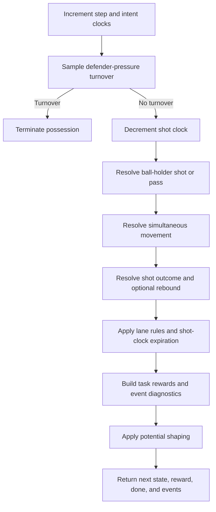

# Environment overview

BasketWorld models one half-court possession per episode. The offense attempts
to create and convert a shot while the defense applies pressure, obstructs
passes, and contests rebounds. Both sides act on each discrete simulation
step.

## Teams and control

For \(N\)-on-\(N\), player IDs are laid out as:

- offense: `0 .. N-1`;
- defense: `N .. 2N-1`.

A role-conditioned policy can train from either perspective. The JAX training
loop collects an offense rollout and a defense rollout on every update and
optimizes one shared parameter tree using both sets of samples.

The environment emits per-player zero-sum rewards, then aggregates the
controlled team into a scalar learner reward. A positive offense event is a
negative defense event of the same total magnitude.

## Static configuration and dynamic state

The JAX kernel separates values that are stable across a compiled rollout from
values that change every step.

`KernelStatic`
: Court cells and lookup tables, team IDs, action-slot mappings, legal-move
  tables, three-point and lane masks, physics parameters, reward parameters,
  start-template arrays, rebound tables, and intent configuration.

`KernelState`
: Player positions, ball holder, shot clock, step count, terminal flag,
  pressure exposure, lane counters, scores, assist state, intent state,
  per-episode shooting and rebound skills, and rebound reward bookkeeping.

Every state field is batched. If `kernel_batch_size = B`, positions have shape
`(B, 2N, 2)`, the ball holder has shape `(B,)`, and so on. Static tables have
fixed shapes known during compilation.

## Reset

A reset samples or constructs:

1. a shot clock between `min_shot_clock` and `shot_clock`;
2. per-offense-player layup, three-point, and dunk percentages;
3. per-player rebound skills;
4. legal offense positions and matched defense positions;
5. an offensive ball holder;
6. optional offensive and defensive intent state.

When start templates are enabled and selected, the template replaces the
random positions, ball holder, and optionally the shot clock. Player-to-template
slot assignment and bounded position jitter are still randomized on device.

## Step ordering

An active step follows this conceptual order:

This order matters. For example, defender pressure is sampled before the
chosen action; non-shooters can move on a shot step before rebound winner
sampling; and an offensive rebound can keep the episode alive.

## Terminal and continuing events

The normal terminal events are:

- intercepted or invalid pass;
- ball-handler move out of bounds;
- defender-pressure turnover;
- offensive three-second turnover;
- shot-clock turnover;
- made shot;
- any shot when rebounds are disabled;
- defensive rebound when rebounds are enabled;
- defensive lane violation.

An offensive rebound is the principal non-terminal shot outcome. The rebound
winner receives the ball, lane counters reset, and the shot clock is raised to
the configured offensive-rebound reset value if it was below that value.

## Python construction seam

The current JAX trainer still constructs a Python environment during setup.
This is used to validate configuration and compile court-dependent data into
`KernelStatic`. Rollout stepping itself uses the JAX kernel; it does not call
the Python environment once per step.
