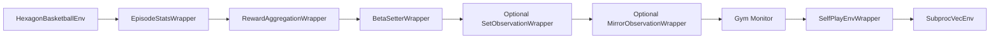

# Historical SB3 architecture

!!! warning "Legacy path"

    The Stable-Baselines3 stack is retained for historical checkpoints,
    behavior references, and parity testing. New training work should use
    `basketworld_jax`. This page describes the old system; it is not a
    maintained start-to-finish training tutorial.

Before the JAX migration, BasketWorld training combined a Python Gymnasium
environment, process-based vector environments, Stable-Baselines3 PPO, custom
PyTorch policies, and a large callback layer.

## Environment and wrapper stack

The base environment is `basketworld.envs.basketworld_env_v2.HexagonBasketballEnv`.
Its implementation is split across Python helpers for:

- axial/offset geometry;
- movement;
- shooting and defender pressure;
- passing and interceptions;
- rewards and termination;
- observation construction and rendering.

`train/env_factory.py` wrapped that environment for learning:

`SelfPlayEnvWrapper` accepted the learning side's actions, queried a frozen
opponent policy for the other team, resolved illegal actions, and assembled
the full environment joint action.

`SubprocVecEnv` stepped many Python environments in child processes. A mixed
pool assigned approximately half of the environments to offense learning and
half to defense learning.

## Unified SB3 policy

The training loop ultimately used one unified PPO model for both roles.
`role_flag` selected the active perspective.

Several policy generations existed:

- ordinary multi-input MLP with pass-logit controls;
- dual-critic policy with separate offense and defense value heads;
- optional dual actor heads;
- set-observation attention policy;
- pointer-targeted pass distribution;
- optional runtime intent embeddings and selector heads.

The PyTorch `SetAttentionExtractor` followed the same broad idea later ported
to Flax: broadcast globals to player tokens, apply a shared token MLP, append
CLS tokens, perform multi-head self-attention, and route player/CLS outputs to
policy and value heads.

The legacy set wrapper currently constructs 15 features per player and four
globals. The JAX observation has evolved independently to include rebound
context and skill features; do not assume checkpoint input parity from package
names alone.

## Alternating self-play workflow

`train/train.py` organized training into alternations:

1. load or sample a historical unified-policy checkpoint as opponent;
2. create a mixed offense/defense `SubprocVecEnv`;
3. attach the current unified policy;
4. call SB3 `learn()` for the scheduled timesteps;
5. save `unified_iter_<n>.zip` to MLflow;
6. optionally evaluate and save discriminator artifacts;
7. repeat with a newly sampled opponent.

The word *alternation* refers to opponent/checkpoint phases. Within a phase,
offense and defense samples were collected simultaneously from different
vector-environment rows.

## Callback-driven extensions

SB3 owned rollout collection, GAE, minibatches, and PPO optimization internally.
BasketWorld added behavior around those stages through callbacks:

- MLflow metrics and episode statistics;
- entropy, phi beta, pass bias, pass curriculum, and task-reward schedules;
- environment timing and profiling;
- intent discriminator training and reward injection;
- selector training and intent policy-sensitivity diagnostics;
- evaluation, opponent mapping, and sample artifacts.

This made advanced experiments possible, but distributed the effective
training algorithm across SB3 internals, wrappers, callbacks, and policy
subclasses.

## Checkpoints

SB3 serialized policy, optimizer, and algorithm state into PyTorch-backed
`.zip` files. BasketWorld stored alternation checkpoints under `models/` in
MLflow and used a run ID plus artifact name to recover historical opponents or
continue training.

Custom policy classes and compatibility objects are required to load some old
checkpoints. Observation encoding, role flags, pointer passing, and intent
configuration also need to match the run metadata.

## SB3-to-JAX mapping

| SB3/Python component | JAX replacement |
|---|---|
| Python `env.step()` per environment | Pure single-state transition plus `jax.vmap` |
| `SubprocVecEnv` | Batched `KernelState` arrays |
| `SelfPlayEnvWrapper` | Compiled joint-action assembly and opponent runners |
| SB3 rollout buffer | `TrajectoryBatch` and `PPOBatch` |
| SB3 GAE/PPO internals | Explicit JAX scans and Optax updates |
| PyTorch policy classes | Flax `ActorCriticModule` |
| Per-env opponent model calls | Frozen or grouped batched opponent parameters |
| Callback schedules | Values computed explicitly in the outer update loop |
| Callback discriminator | JAX discriminator runner and explicit bonus injection |
| SB3 `.zip` | Orbax state plus JSON metadata |
| Python evaluation loop | Compiled and native JAX evaluation |

## Why JAX became primary

The migration was motivated by more than changing neural-network libraries.
It moved environment advancement and self-play inference into the same compiled
array program as rollout collection.

The main benefits are:

- higher batched throughput without Python/process communication per step;
- explicit PRNG and state flow;
- visible PPO, selector, and discriminator objectives;
- batched historical-opponent inference;
- checkpoint metadata that reconstructs model and environment shapes;
- one source of JAX environment semantics for training and native evaluation.

The SB3 implementation remains valuable as the origin of many mechanics and as
a comparison target. It should not be used to infer current JAX behavior when
the JAX kernel or tests differ.
