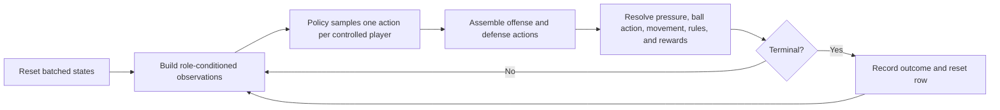

# BasketWorld

BasketWorld is a half-court basketball environment for reinforcement-learning
research. A possession unfolds on a hexagonal court: every player chooses an
action at each simulation step, the environment resolves the joint action, and
the episode ends on a made basket, turnover, defensive rebound, rule violation,
or shot-clock expiration. An offensive rebound can extend the possession.

The primary implementation is the batched JAX stack in `basketworld_jax/`. It
contains the environment kernel, Flax actor-critic, custom PPO runtime, intent
learning, evaluation, and Orbax checkpoints. The older Python/Gymnasium and
Stable-Baselines3 implementation remains in `basketworld/` and `train/` for
legacy checkpoints, parity tests, and historical context.

!!! note "Scope"

    These docs cover the environment, its physics, and RL training. The web
    application, backend routes, and frontend are intentionally out of scope.

## A possession at a glance

BasketWorld is not a rigid recreation of every basketball rule. It is a
parameterized research environment whose mechanics are designed to be:

- explicit enough to inspect and test;
- stochastic enough to support skill and strategy learning;
- vectorizable enough to run many possessions inside compiled JAX programs;
- compatible with zero-sum offense-versus-defense self-play.

## Where to begin

If you want to run the site or a small training smoke test, start with
[Getting started](getting-started.md).

To understand what the agent sees and controls, read:

1. [Environment overview](environment/index.md)
2. [Court and geometry](environment/geometry.md)
3. [Actions and observations](environment/actions-observations.md)

For the mechanics behind outcomes, use the
[Physics and rewards](physics/movement-rules.md) section. For model and
optimization details, use the [JAX implementation](jax/index.md) section.

## Source-of-truth policy

The executable code and tests are authoritative. In particular:

- `basketworld_jax/env/minimal.py` defines JAX transition, observation, and
  reward semantics;
- `basketworld_jax/models/actor_critic.py` defines the Flax policy;
- `basketworld_jax/train/runtime.py` defines compiled rollout and update
  functions;
- `basketworld_jax/train/main.py` defines the current trainer CLI and
  orchestration;
- `tests/test_jax_*.py` and focused environment tests capture expected
  behavior.

Older plans under `docs/` and `readmes/` are useful design history, but their
unchecked status lists are not treated as current behavior here.
