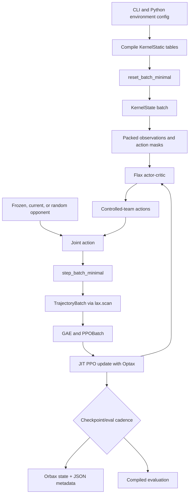

# JAX architecture

The JAX stack moves the rollout-critical environment, action selection, and PPO
update into array programs with stable shapes. Python remains the outer
orchestrator for CLI configuration, MLflow, checkpoint selection, and
human-readable summaries.

## Package map

| Package | Responsibility |
|---|---|
| `basketworld_jax/env/minimal.py` | Batched reset, transition, masks, observations, rules, and rewards |
| `basketworld_jax/models/actor_critic.py` | Flax MLP and attention actor-critic |
| `basketworld_jax/train/types.py` | Trajectory, PPO, selector, and evaluation containers |
| `basketworld_jax/train/runtime.py` | Compiled rollout, update, selector, and evaluation runners |
| `basketworld_jax/train/main.py` | CLI, schedules, self-play orchestration, metrics, and checkpoint cadence |
| `basketworld_jax/intent/discriminator.py` | Intent discriminator, bonuses, and sample diagnostics |
| `basketworld_jax/checkpoints/checkpoint.py` | Orbax state and JSON metadata serialization |
| `basketworld_jax/eval/native.py` | Batched JAX-native evaluation and aggregation |

## End-to-end data flow

## Array-oriented environment

`step_batch_minimal` uses `jax.vmap` over one pure single-state transition.
The rollout runner uses `jax.lax.scan` over the configured horizon. The entire
runner is JIT compiled with horizon as a static argument.

This composition provides:

- one compiled transition program for a batch of possessions;
- explicit PRNG keys for every stochastic decision;
- no Python environment loop inside rollout collection;
- predictable trajectory shapes for PPO.

Terminal rows can be reset inside the scan and continue producing samples.
When single-episode mode is enabled, they remain inactive and their later
trajectory entries are masked.

## Configuration seam

The trainer initially builds the legacy Python `HexagonBasketballEnv` through
`train/env_factory.py`. This is not the rollout engine. It is a convenient
configuration and geometry compiler:

1. validate the broad environment argument surface;
2. construct court cells, masks, and template data;
3. load and validate optional rebound artifacts;
4. snapshot representative state;
5. convert everything into `KernelStatic` and `KernelState` arrays.

JAX then owns reset and step behavior for training and native evaluation.

## Rollout variants

The runtime builds distinct compiled runners for:

- same-policy/current-policy collection;
- one frozen opponent;
- grouped frozen opponents;
- training evaluation;
- fixed-seed deploy-style evaluation.

They share environment and policy primitives. The variants differ mainly in
how opponent parameters and deterministic-versus-sampled actions are supplied.

## Explicit orchestration

Unlike an SB3 algorithm object, the outer loop makes stages visible:

1. compute schedules for the update;
2. collect offense and defense rollouts;
3. update optional intent discriminators and reward bonuses;
4. build and concatenate PPO batches;
5. update actor-critic parameters;
6. update selector-only parameters when scheduled;
7. summarize and log metrics;
8. evaluate and checkpoint at configured intervals.

This explicitness is useful for research: task reward, shaping, intent bonus,
opponent selection, and update timing are separately observable.

## Shape stability

JAX compilation is specialized to shapes and static choices. Important
shape-bearing settings include:

- player count;
- court geometry and cell count;
- kernel batch size;
- rollout horizon;
- observation family;
- policy architecture;
- action-head mode;
- PPO batch size and minibatch count;
- opponent group count.

Changing one can trigger compilation. The runtime also rejects calling a
compiled PPO runner with a new batch size.
