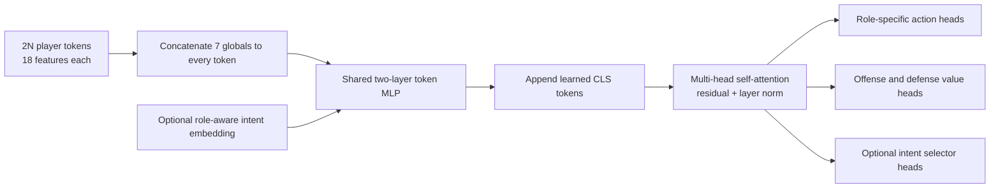

# Policy architecture

`ActorCriticSpec` records every shape and architecture choice needed to rebuild
a policy from a checkpoint. Two model families are supported.

## MLP baseline

The `mlp` model consumes the flat observation, applies configurable tanh hidden
layers, and produces:

- one flat policy-logit vector for all controlled players;
- one scalar value.

It is retained for performance baselines and debugging. Intent embeddings and
the integrated selector require the attention model. The pointer-targeted
action head also currently requires attention.

## Attention model

The attention path unpacks the flat transport vector into player tokens,
globals, and a role flag.

The shared token MLP is:

1. dense to `attention_token_mlp_dim`;
2. ReLU;
3. dense to `attention_embed_dim`.

One multi-head self-attention block operates on all player and CLS tokens. Its
output is added to the input and layer-normalized.

`attention_embed_dim` must be divisible by `attention_num_heads`.

## Player and role selection

Attention runs over both teams. The policy head then selects the controlled
team's player tokens using the role flag:

- offense role selects token rows `0 .. N-1`;
- defense role selects token rows `N .. 2N-1`.

Optional post-attention policy MLP layers operate on those tokens. Separate
linear heads produce offense and defense logits; the role flag selects the
active result.

This creates one shared representation with role-specialized decisions.

## Value heads and CLS tokens

With the standard two CLS tokens:

- CLS 0 feeds the offense value path and intent selector;
- CLS 1 feeds the defense value path.

Optional post-attention value MLP layers are shared across the stacked CLS
representations. Separate final dense layers produce offense and defense
values, and the role flag selects one scalar.

With one CLS token, both values share it. With no CLS token, mean-pooled player
tokens are used. Two CLS tokens are the intended dual-role configuration.

## Flat action head

In `flat` mode, the selected player token produces 14 logits directly.
Action masking is applied afterward.

Although pass action IDs are mapped to teammate slots by the environment,
their logits are independent outputs in this head.

## Pointer-targeted action head

The pointer head factorizes each player's decision into:

1. an action type over all non-pass actions plus one abstract `PASS`;
2. a pass target over valid teammate slots.

Role-specific action-type heads read the controlled player tokens. Pass-target
scores use learned role-specific query and key projections and scaled dot
products between passer and teammate token embeddings.

For non-pass action \(a\):

\[
\log \pi(a|s) = \log \pi_{\text{type}}(a|s).
\]

For pass slot \(j\):

\[
\log \pi(\text{pass}_j|s) =
\log \pi_{\text{type}}(\text{PASS}|s)
+\log \pi_{\text{target}}(j|s,\text{PASS}).
\]

These values are written back into the original 14-action layout, allowing the
rollout buffer and environment to retain a simple discrete action per player.

## Action masking and joint log probability

Illegal logits are set to approximately \(-10^9\), then normalized per player.
Sampling returns one action and selected log probability for each controlled
player.

PPO treats the controlled team's joint choice as one state action by summing
player log probabilities:

\[
\log \pi(\mathbf a|s) = \sum_{i=1}^{N}\log\pi(a_i|s).
\]

The PPO ratio is computed from this joint log probability. Entropy metrics
average per-player categorical entropy.

## Intent conditioning

When enabled, offense and defense have separate intent embedding tables.
The active intent is projected to token width and added to every player token
before attention:

\[
h_i' = h_i + g\,W_{\text{role}}e_z,
\]

where \(g\in[0,1]\) is the runtime intent gate. A zero gate gives the
unconditioned policy. Selector inference itself uses a neutral zero-gate
context so it does not choose a new intent based on the currently active
intent embedding.

## Initialization

Dense layers use fan-in variance scaling with zero biases. Final selector
policy and value heads are zero-initialized, giving uniform selector
probabilities and zero selector values before training.
