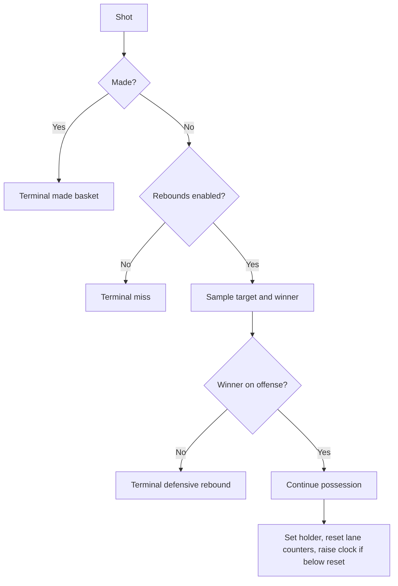

# Rebounds

Rebounds are optional. When disabled, every shot ends the possession. When
enabled, a missed shot samples a plausible target from an offline-fitted model
and then samples a winner from player position and skill.

## Offline physics, online table

The training kernel does not run MuJoCo. The offline pipeline under
`analytics/rebound_physics/` simulates shot trajectories, filters missed
shots, maps catch or landing locations back to court cells, and fits a table.

At environment construction time, the table is validated against the active
court and expanded into a dense JAX array:

```text
target_probs[shot_type, shot_cell, target_cell]
```

Shot types are dunk, two-point shot, and three-point shot. Symmetry and
canonical-cell lookup are resolved before JIT compilation.

`--enable-rebounds` requires `--rebound-table-model-dir`; the trainer rejects a
missing artifact instead of silently inventing a distribution.

## Target distribution

Let \(p(x)\) be the fitted target probability for the current shot type and
cell. A configurable uniform mixture gives:

\[
p_{\text{mix}}(x) =
(1-u)p(x) + \frac{u}{|\mathcal C|},
\]

where \(u\) is `rebound_target_uniform_mix` and \(\mathcal C\) is the set of
court cells.

Temperature is applied in log-probability space:

\[
p_T(x) =
\operatorname{softmax}
\left(\frac{\log\max(p_{\text{mix}}(x),10^{-8})}{T_{\text{target}}}\right).
\]

The environment samples one target cell from \(p_T\) after a miss.

Policy observations expose only distributional summaries—the expected target,
entropy, and each player's distance to that expected target. They never expose
the sampled future cell.

## Winner score

For player \(i\) and sampled target \(x\), define:

- \(d_i\): hex distance from the player's current cell to \(x\);
- \(b_i=\max(0,d_{\text{hoop},i}-d_{\text{hoop},x})\): penalty for being
  farther from the basket than the target;
- \(s_i\): sampled rebound skill.

The effective target distance is:

\[
d_i^{\text{eff}} = d_i - w_s s_i.
\]

The winner logit is:

\[
\ell_i =
\frac{-w_d d_i^{\text{eff}} - w_b b_i}{T_{\text{winner}}}.
\]

The winner is sampled from `softmax(logits)`. Distance weight, basket-position
weight, skill weight, and winner temperature are all configurable.

Two skill sampling modes are available:

- `gaussian`: independent zero-centered skill noise with configurable standard
  deviation;
- `one_high_per_team`: one specialist per team receives the high value and
  teammates receive the low value.

## Global and local contests

`global_contest` allows every player to enter the winner softmax.

`local_contest` keeps only players within `rebound_contest_radius` of the
sampled target. If nobody qualifies, the kernel falls back to the global
contest so the softmax is always well-defined.

The sampled target is event metadata, not a teleport destination. Players stay
where movement placed them; only `ball_holder` changes to the sampled winner.

## Possession outcomes



On an offensive rebound:

- possession continues;
- the winner becomes ball holder;
- offense and defense lane counters reset;
- the shot clock becomes at least the configured rebound reset value;
- the event creates a valid selector boundary.

On a defensive rebound, the possession terminates. Full-court transition play
is outside the current environment model.

## Reward interaction

With rebounds enabled, the recommended `actual_points` terminal mode pays made
points and zero for misses. Alternative modes can pay terminal-shot expected
points for lower-variance research objectives.

Optional rebound reward redistribution grants a temporary reward advance on an
offensive rebound and settles the accumulated advance negatively at terminal
time. This can make the continuation event locally visible without changing
the intended episode-level return. See
[Rewards and termination](rewards-termination.md).
