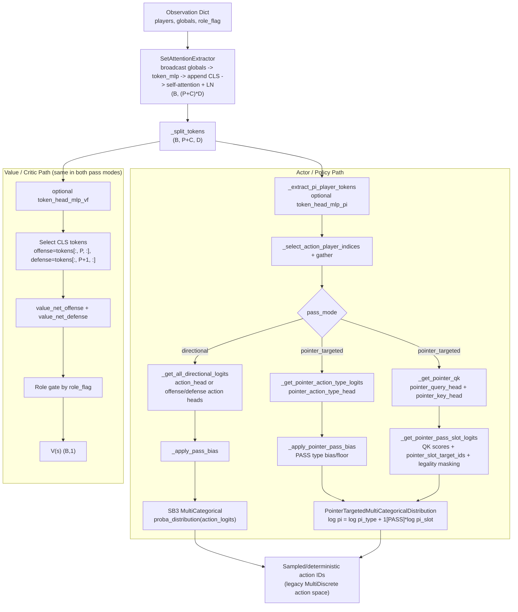

# Set-Attention Policy/Value Architecture (Mermaid)

This is the current architecture for `SetAttentionDualCriticPolicy`, including both actor branches (`directional` and `pointer_targeted`) and the dual-critic value path.

## Notes

- Pointer targeting adds actor-side heads and factorized action distribution only.
- Value estimation still uses the same two critics: `value_net_offense` and `value_net_defense`.
- Both actor branches emit actions in the same legacy action ID space so SB3 rollout buffers remain compatible.

## Code Anchors

- `basketworld/policies/set_attention_policy.py`
  - `SetAttentionExtractor.forward`
  - `_get_action_dist_from_latent`
  - `_get_pointer_pass_slot_logits`
  - `_get_value_from_latent`
